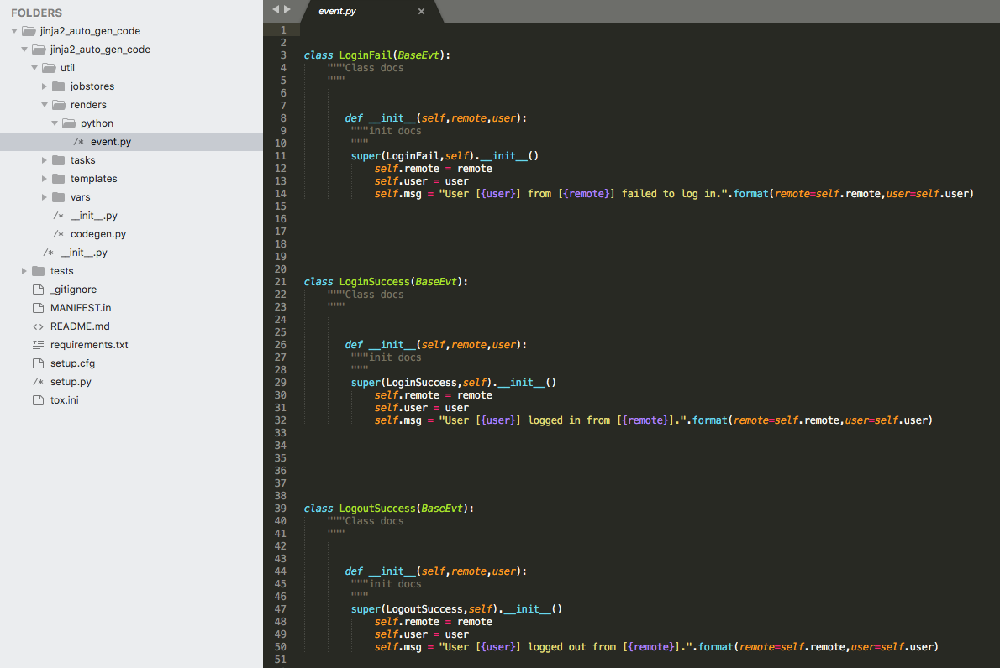

# Jinja2 gen code
<h3>Description</h3>
    The easiest way to generate the source code or files.
    You can add new template and source variables to generate files.
<h3>Image</h3>
  

      
  

<h3>Quick Start</h3>
  After git clone the project, try to add the template and source data.
  Give the event.py example:
  <pre><code>
    # install the package
    sudo python setup.py install
    # generate source code cmd (ex: event.py)
    ./codegen.py -e event.py -v event_en_us.yml -t event.j2
  </pre></code>

